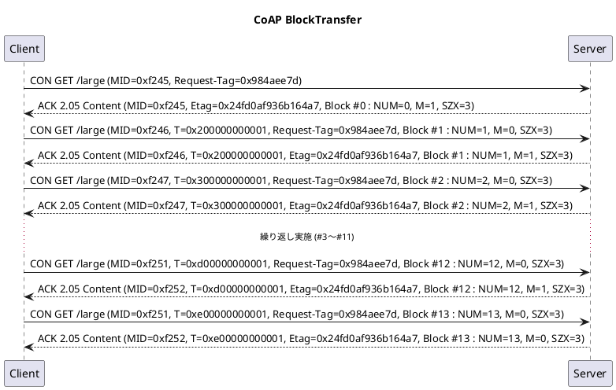

# Block オプション

ブロックオプションはデータをアップロード・ダウンロードする際にデータを分割するために用いられるオプションになる。

ブロックオプションとしては以下の2種類の機能が提供されている。

- Block-Wise Transfer : [RFC7959: Block-Wise Transfers in the Constrained Application Protocol (CoAP)](https://tex2e.github.io/rfc-translater/html/rfc7959.html)
- Q-Block : [RFC9177: Constrained Application Protocol (CoAP) Block-Wise Transfer Options Supporting Robust Transmission](https://tex2e.github.io/rfc-translater/html/rfc9177.html)

## Block-Wise Transfer

ブロックオプションとしては以下の 2 種類が存在する。

- block1 : クライアントがサーバーにデータをアップロードする際にデータを分割するためのオプション (クライアントの Request 送信)
- block2 : クライアントがサーバーからデータをダウンロードする際にデータを分割するためのオプション (クライアントの Response 受信)

オプションとして[CoAP.md](./CoAP.md)で説明したように、以下の構造となる。

| 名称                   | データ長           | 内容                                                                     |
| ---------------------- | ------------------ | ------------------------------------------------------------------------ |
| オプションデルタ       | 4 ビット           | 1 つ前に示した No.との差分(先頭の場合には対応する No を記載)             |
| オプションの長さ       | 4 ビット           | 対応するオプションデータのデータ長                                       |
| オプションデルタ(拡張) | 0〜2 バイト        | オプションデルタにて 13,14,15 が設定された場合に各項目に対応する値を設定 |
| オプションの長さ(拡張) | 0〜2 バイト        | オプションの長さにて 13,14,15 が設定された場合に各項目に対応する値を設定 |
| オプションデータ       | 0 以上(バイト単位) | オプションデルタに対応する値を設定                                       |

ブロックオプション(block1、block2 に依存しない)におけるオプションデータは以下の構造となり、サイズは 1〜3 バイトのデータとなる。
データサイズは上記の"オプションの長さ"にて定義する。

| 名称                    | データ長     | 内容                                                                               |
| ----------------------- | ------------ | ---------------------------------------------------------------------------------- |
| NUM(ブロック番号)       | 4〜20 ビット | 要求または提供されているブロック番号を示します                                     |
| M(More フラグ)          | 1 ビット     | 引き続き分割送信されるデータの有無を判定する(1=続きあり / 0=最後)                  |
| SZX(ブロックサイズ指数) | 3 ビット     | 値として 0〜6 まで設定でき、送信する最大ペイロードサイズは 2 \*\*（SZX + 4）になる |

通信時の例を以下に示す．
このとき、ACKで返ってくる応答にはpayloadが格納されており、すべてNUMで設定された順に連結したデータが意味のあるデータとなる。
また、最後のブロック#13で取得したデータのみが128バイト未満となる。

ここでは発生していないが、受信データに欠損があった場合にはクライアント側にて再送を行う。
通信の初期タイムアウトはACK_TIMEOUT(デフォルト:4)と(ACK_TIMEOUT(デフォルト:4) \* ACK_RANDOM_FACTOR(デフォルト:1.5))の間のランダムな値となり、最大の再送回数は MAX_RETRANSMIT(デフォルト:4)回となる。
また、再送する度にタイムアウト時間を2倍にされていき、送信してから再送するまでの時間はACK_TIMEOUT \* 2 \*\*(再送回数 - 1)〜ACK_TIMEOUT \* 2 \*\* (再送回数 - 1) \* ACK_RANDOM_FACTOR(デフォルト:1.5)の間のランダムな値となる。
このときの設定パラメータは[RFC 7252 - The Constrained Application Protocol (CoAP)](https://tex2e.github.io/rfc-translater/html/rfc7252.html#4-8--Transmission-Parameters)の 4.8. Transmission Parameters に記載されている。

Block-Wise Transferで利用するパラメータとしてSize1、Size2のオプションが用意されており、これらのオプションは任意で指定できるオプションとなる。
Size1は送信するデータのサイズを指定するオプションで、Size2は受信するデータのサイズを指定するオプションとなる。

## Q-Block

Q-Block は Block-Wise Transfer を拡張したもので、より効率的なデータ転送を実現する機能となる。
Q-Block は以下の 2 つの機能を提供する。
