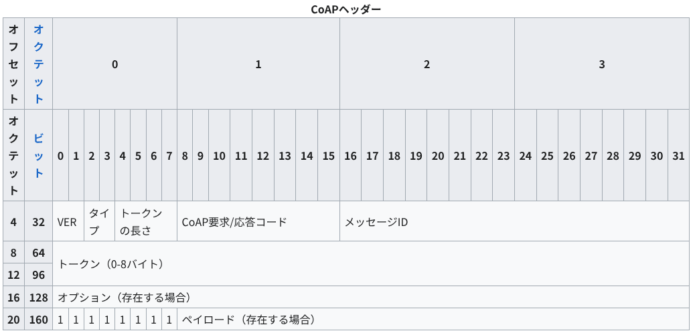
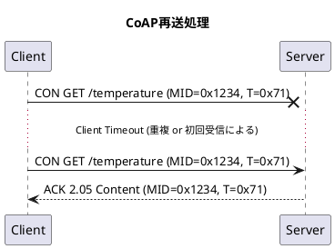
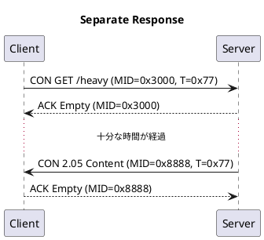
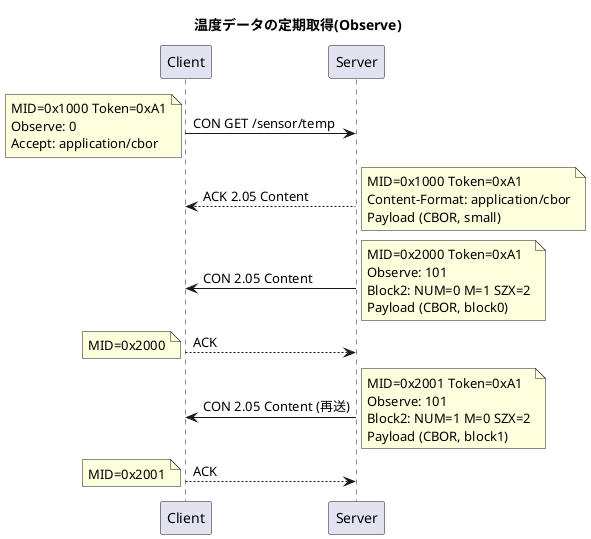
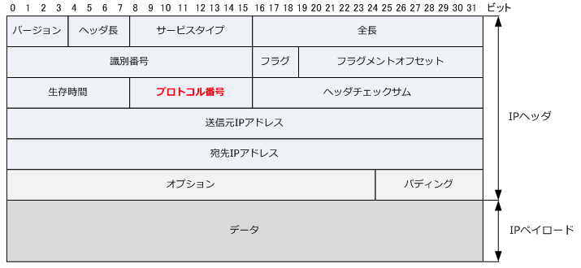
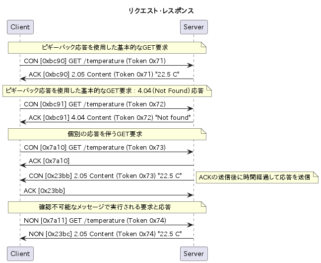

# CoAP プロトコル

CoAP(Constrained Application Protocol)プロトコルは IoT などの制約上環境(低電力・低帯域・損失あり)で HTTP に似た REST モデル（GET/PUT/POST/DELETE 等）を実現するためのアプリ層プロトコルになる。
基本は UDP 上で動作し、より詳細な仕様は[RFC7252](https://tex2e.github.io/rfc-translater/html/rfc7252.html)に記載されている。
CoAP の拡張に関わる RFC として以下のものが存在し、更に拡張が続いている。
通信の保護機能として、パケット全体を暗号化する"DTLS(Datagram Transport Layer Security)"やメッセージ（CoAP など）単位でペイロードのみを暗号化・認証する"OSCORE(Object Security for Constrained RESTful Environments)"が提供されている。

- [RFC7252: The Constrained Application Protocol (CoAP)](https://tex2e.github.io/rfc-translater/html/rfc7252.html)
- [RFC7390: Group Communication for the Constrained Application Protocol (CoAP)](https://tex2e.github.io/rfc-translater/html/rfc7390.html)
- [RFC7641: Observing Resources in the Constrained Application Protocol (CoAP)](https://tex2e.github.io/rfc-translater/html/rfc7641.html)
- [RFC7959: Block-Wise Transfers in the Constrained Application Protocol (CoAP)](https://tex2e.github.io/rfc-translater/html/rfc7959.html)
- [RFC7967: Constrained Application Protocol (CoAP) Option for No Server Response](https://tex2e.github.io/rfc-translater/html/rfc7967.html)
- [RFC8132: PATCH and FETCH Methods for the Constrained Application Protocol (CoAP)](https://tex2e.github.io/rfc-translater/html/rfc8132.html)
- [RFC8323: CoAP (Constrained Application Protocol) over TCP, TLS, and WebSockets](https://tex2e.github.io/rfc-translater/html/rfc8323.html)
- [RFC8516: "Too Many Requests" Response Code for the Constrained Application Protocol](https://tex2e.github.io/rfc-translater/html/rfc8516.html)
- [RFC8613: Object Security for Constrained RESTful Environments (OSCORE)](https://tex2e.github.io/rfc-translater/html/rfc8613.html)
- [RFC8768: Constrained Application Protocol (CoAP) Hop-Limit Option](https://tex2e.github.io/rfc-translater/html/rfc8768.html)
- [RFC8974: Extended Tokens and Stateless Clients in the Constrained Application Protocol (CoAP)](https://tex2e.github.io/rfc-translater/html/rfc8974.html)
- [RFC9175: CoAP: Echo, Request-Tag, and Token Processing](https://tex2e.github.io/rfc-translater/html/rfc9175.html)
- [RFC9177: Constrained Application Protocol (CoAP) Block-Wise Transfer Options Supporting Robust Transmission](https://tex2e.github.io/rfc-translater/html/rfc9177.html)

## CoAP メッセージフォーマット

メッセージフォーマットの全体像は図に記載する．

また，CoAP ヘッダーの内容の詳細を以下に記載する．

| 名称                 | データ長      | 内容                                                                                                                                               |
| -------------------- | ------------- | -------------------------------------------------------------------------------------------------------------------------------------------------- |
| Ver                  | 2 ビット      | CoAP バージョン番号を示す                                                                                                                          |
| タイプ               | 2 ビット      | このメッセージのタイプが確認可能(0)、非確認可能(1)、確認応答(2)、またはリセット(3)のいずれであるかを示す                                           |
| トークンの長さ       | 4 ビット      | 可変長トークンフィールドの長さを示す(長さは 0〜8 バイト)                                                                                           |
| CoAP 要求/応答コード | 8 ビット      | 上位 3 ビットは HTTP ステータスコードのクラスに類似した「クラス」として知られる数値、下位 5 ビットは要求または応答に関する詳細を伝えるコードになる |
| メッセージ ID(MID)   | 16 ビット     | "UDP 上のメッセージ配送"(再送・ACK・重複排除)                                                                                                      |
| トークン             | 0-8 バイト    | リクエスト/レスポンスの相関(トランザクション層)                                                                                                    |
| オプション           | Variable      | HTTP ヘッダ相当の情報(URI 関連・キャッシュ・Block 設定等)                                                                                          |
| ペイロードマーカー   | 0 or 8 ビット | ペイロードが存在する場合にのみ存在し，オプションとペイロードの区切りを明示するものとなる                                                           |
| ペイロード           | Variable      | リクエストやレスポンス時に格納されるデータ                                                                                                         |

このときの CoAP で利用するコードやオプション番号などは[CoAP 関連情報](https://www.iana.org/assignments/core-parameters/core-parameters.xhtml#codes)に記載しているため，この内容を確認する．

### メッセージ ID と TOKEN の違い

メッセージ ID は"再送・ACK・重複排除"といったリクエスト・レスポンスでのエラー処理を担っている．以下のシーケンスは再送処理を実行したときの例となり，ここで再送の前後でのメッセージ ID は変わっておらず，同じメッセージ ID を利用している．Server から Client にレスポンスを返す際にはすぐに ACK を返すのではなく，ACK の応答を遅らせて温度データを電文に載せてレスポンスとして返している(piggybacked response)ことを認識しておく．

※ 以降の図などで、"T"は"Token", "MID"は"メッセージ ID"を表す。

ただし，上記の例ではトークンの値も変わっておらず，トークンを用いる意義が不明のままとなる．そこで，以下の例を用いてトークンの利用意義を説明する．このときの例は CON にて GET した際に，サーバが ACK で応答を返した後にデータを返す処理(Separate Response)のシーケンスとなる．

ここのシーケンスでは，Server 側がすぐに応答を返すことができない場合に，一時的に ACK を返した上で一定時間経過後に CON で応答を返し，Client が Server に ACK を返す形式となっている．
この方式を Separate Response という．

このとき，各メッセージ ID(MID)とトークンを確認すると，CON と ACK の対応関係では MID が一致しており，CON と ACK にてリクエストとレスポンスの関係が成立していることが確認できる．ただし，ここで求めている GET リクエストとして取得する値は ACK 受信時には取得できていない．この GET で要求している値との対応関係を取るものがトークンとなる．"CON GET"リクエストのトークンと"CON 2.05 Content"レスポンスのトークンが一致しており，レスポンス内容でも"CON 2.05 Content"になっており，GET リクエストの要求内容がレスポンス内部に格納されていることが確認できる．

以上のことから，MID はリクエストとレスポンス間での再送や重複チェックなどのメッセージ配送の識別情報，トークンはデータ取得とそれに対応する応答といったトランザクションの識別情報になることが確認できる．

### CoAP 要求/応答コードの詳細

CoAP 要求/応答コードの詳細は[RFC7252 : 12.1 章](https://datatracker.ietf.org/doc/html/rfc7252#section-12.1)に記載されている．また、下記の図の"X.YY"において CoAP 要求/応答コードの 8 ビットの内で先頭の 3 ビットが"X"、残りの 5 ビットが"YY"を表す。その時のコード一覧は以下となる．

| Code      | 内容                                                          |
| --------- | ------------------------------------------------------------- |
| 0.00      | 空のメッセージ                                                |
| 0.01-0.31 | 要求("CoAP メソッドコード"サブレジストリにより割り当てられる) |
| 1.00-1.31 | 予約済み                                                      |
| 2.00-5.31 | 応答("CoAP 応答コード"サブレジストリにより割り当てられる)     |
| 6.00-7.31 | 予約済み                                                      |

要求時の"CoAP メソッドコード"サブレジストリは以下の表となる．

| Code | 名称   | 参照                                                   |
| ---- | ------ | ------------------------------------------------------ |
| 0.01 | GET    | [RFC7252](https://www.rfc-editor.org/rfc/rfc7252.html) |
| 0.02 | POST   | [RFC7252](https://www.rfc-editor.org/rfc/rfc7252.html) |
| 0.03 | PUT    | [RFC7252](https://www.rfc-editor.org/rfc/rfc7252.html) |
| 0.04 | DELETE | [RFC7252](https://www.rfc-editor.org/rfc/rfc7252.html) |

応答時の"CoAP 応答コード"サブレジストリは以下の表となる．このときの概要は以下となる．

- 2.xx Success: 2.01 Created / 2.04 Changed / 2.05 Content …
- 4.xx Client Error: 4.00 Bad Request / 4.04 Not Found / 4.15 Unsupported Content-Format …
- 5.xx Server Error: 5.00 Internal Server Error / 5.03 Service Unavailable …

その詳細な情報の一部を以下となり，より正確な情報は[CoAP Response Codes](https://www.iana.org/assignments/core-parameters/core-parameters.xhtml#response-codes)を参照する．

| Code | Description                | Reference                                              |
| ---- | -------------------------- | ------------------------------------------------------ |
| 2.01 | Created                    | [RFC7252](https://www.rfc-editor.org/rfc/rfc7252.html) |
| 2.02 | Deleted                    | [RFC7252](https://www.rfc-editor.org/rfc/rfc7252.html) |
| 2.03 | Valid                      | [RFC7252](https://www.rfc-editor.org/rfc/rfc7252.html) |
| 2.04 | Changed                    | [RFC7252](https://www.rfc-editor.org/rfc/rfc7252.html) |
| 2.05 | Content                    | [RFC7252](https://www.rfc-editor.org/rfc/rfc7252.html) |
| 4.00 | Bad Request                | [RFC7252](https://www.rfc-editor.org/rfc/rfc7252.html) |
| 4.01 | Unauthorized               | [RFC7252](https://www.rfc-editor.org/rfc/rfc7252.html) |
| 4.02 | Bad Option                 | [RFC7252](https://www.rfc-editor.org/rfc/rfc7252.html) |
| 4.03 | Forbidden                  | [RFC7252](https://www.rfc-editor.org/rfc/rfc7252.html) |
| 4.04 | Not Found                  | [RFC7252](https://www.rfc-editor.org/rfc/rfc7252.html) |
| 4.05 | Method Not Allowed         | [RFC7252](https://www.rfc-editor.org/rfc/rfc7252.html) |
| 4.06 | Not Acceptable             | [RFC7252](https://www.rfc-editor.org/rfc/rfc7252.html) |
| 4.12 | Precondition Failed        | [RFC7252](https://www.rfc-editor.org/rfc/rfc7252.html) |
| 4.13 | Request Entity Too Large   | [RFC7252](https://www.rfc-editor.org/rfc/rfc7252.html) |
| 4.15 | Unsupported Content-Format | [RFC7252](https://www.rfc-editor.org/rfc/rfc7252.html) |
| 5.00 | Internal Server Error      | [RFC7252](https://www.rfc-editor.org/rfc/rfc7252.html) |
| 5.01 | Not Implemented            | [RFC7252](https://www.rfc-editor.org/rfc/rfc7252.html) |
| 5.02 | Bad Gateway                | [RFC7252](https://www.rfc-editor.org/rfc/rfc7252.html) |
| 5.03 | Service Unavailable        | [RFC7252](https://www.rfc-editor.org/rfc/rfc7252.html) |
| 5.04 | Gateway Timeout            | [RFC7252](https://www.rfc-editor.org/rfc/rfc7252.html) |
| 5.05 | Proxying Not Supported     | [RFC7252](https://www.rfc-editor.org/rfc/rfc7252.html) |

また、サブレジストリに追加される場合には[RFC5226](https://www.rfc-editor.org/rfc/rfc5226.html)を参照する．

※ [RFC5226](https://www.rfc-editor.org/rfc/rfc5226.html)は廃止されており、修正版は[RFC8126](https://www.rfc-editor.org/rfc/rfc8126.html)として公開されている．

## CoAP オプションメッセージフォーマット

CoAP オプションの項目は以下の構成要素にて成り立つ．

| 名称                   | データ長           | 内容                                                                     |
| ---------------------- | ------------------ | ------------------------------------------------------------------------ |
| オプションデルタ       | 4 ビット           | 1 つ前に示した No.との差分(先頭の場合には対応する No を記載)             |
| オプションの長さ       | 4 ビット           | 対応するオプションデータのデータ長                                       |
| オプションデルタ(拡張) | 0〜2 バイト        | オプションデルタにて 13,14,15 が設定された場合に各項目に対応する値を設定 |
| オプションの長さ(拡張) | 0〜2 バイト        | オプションの長さにて 13,14,15 が設定された場合に各項目に対応する値を設定 |
| オプションデータ       | 0 以上(バイト単位) | オプションデルタに対応する値を設定                                       |

オプションデルタは 0〜15 までの値を取ることができ，0〜12 の値はそのままオプションデルタの値を示す．ただし，13〜15 の値は以下の特別な構成のために予約されている．

- 13 : 最初のバイトの後に 8 ビットの符号なし整数が続き、デルタ値から 13 を引いたものを示す．
- 14 : ネットワークバイトオーダーの 16 ビット符号なし整数は、最初のバイトに続き、デルタ値から 269 を引いたものを示す．
- 15 : ペイロードマーカー用に予約されている．フィールドがこの値に設定されているが，バイト全体がペイロードマーカーではない場合，これはメッセージフォーマットエラーとして処理される必要がある．

オプションの長さは 0〜0〜15 までの値を取ることができ，0〜12 の値はそのままオプションの長さを示す．ただし，13〜15 の値は以下の特別な構成のために予約されている．

- 13 : 1 バイトの拡張長さフィールドが後に続く（長さ = 13 + 拡張バイト）。
- 14 : 2 バイトの拡張長さフィールドが後に続く（長さ = 269 + 拡張バイト）。
- 15 : ペイロードマーカー用に予約されている．フィールドがこの値に設定されているが，バイト全体がペイロードマーカーではない場合，これはメッセージフォーマットエラーとして処理される必要がある．

以下が設定可能なオプションの一覧となり，詳細なものは[option-numbers](https://www.iana.org/assignments/core-parameters/core-parameters.xhtml#option-numbers)を参照する．

| No. | Name           | Format | Length | Default     |
| --- | -------------- | ------ | ------ | ----------- |
| 1   | If-Match       | opaque | 0-8    | (none)      |
| 3   | Uri-Host       | string | 1-255  | (see below) |
| 4   | ETag           | opaque | 1-8    | (none)      |
| 5   | If-None-Match  | empty  | 0      | (none)      |
| 7   | Uri-Port       | uint   | 0-2    | (see below) |
| 8   | Location-Path  | string | 0-255  | (none)      |
| 11  | Uri-Path       | string | 0-255  | (none)      |
| 12  | Content-Format | uint   | 0-2    | (none)      |
| 14  | Max-Age        | uint   | 0-4    | 60          |
| 15  | Uri-Query      | string | 0-255  | (none)      |
| 17  | Accept         | uint   | 0-2    | (none)      |
| 20  | Location-Query | string | 0-255  | (none)      |
| 28  | Size2          | uint   | 0-4    | (none)      |
| 35  | Proxy-Uri      | string | 1-1034 | (none)      |
| 39  | Proxy-Scheme   | string | 1-255  | (none)      |
| 60  | Size1          | uint   | 0-4    | (none)      |

### 例 : CoAP オプションメッセージフォーマット

CoAP オプションメッセージフォーマットを用いたときの例を以下に記載する．

各処理における電文内容とその解釈方法を上から順に詳細に記載する．

1. CON GET /sensor/temp (Observe 登録リクエスト)

   電文 : 40 01 10 00 A1 61 00 51 73 65 6E 73 6F 72 04 74 65 6D 70 61 60

   これを解釈すると以下のデータ構造となる．

   | 電文                 | ブロック             | 内容                                                               |
   | -------------------- | -------------------- | ------------------------------------------------------------------ |
   | 40 01 10 00          | 固定データ長         | 40 : Ver=1, CON, トークン長=0 01 : GET  10 00 : MID = 0x1000 |
   | 61 00                | オプション(Observe)  | Delta=6 Length=1 value=0(登録)                               |
   | 51 73 65 6E 73 6F 72 | オプション(Uri-Path) | Delta=11-6=5 Length=1 Value=sensor                           |
   | 04 74 65 6D 70       | オプション(Uri-Path) | Delta=11-11=0 Length=4 Value=temp                            |
   | 61 60                | オプション(Accept)   | Delta=17-11=6 Length=1 Value=60(CBOR)                        |

2. ACK 2.05 Content
3. CON 2.05 Content
4. ACK
5. CON 2.05 Content (再送)
6. ACK

## ペイロードのデータフォーマットの識別

CoAP プロトコルのペイロードには CBOR や JSON などの多様な表現方法を使用することができる．
そのため，ペイロードとしてどのフォーマット化を識別するための機能が必要となる．

これを CoAP プロトコルで考えた際，対応する内容はオプションの"Content-Format"になる．
もし"Content-Format"が指定されずに応答のペイロードが設定される場合，このときのペイロードの表現は診断ペイロードとなり，UTF-8 で入力された文字列データが格納される．( [参考 URL](https://tex2e.github.io/rfc-translater/html/rfc7252.html#5-5-2--Diagnostic-Payload) )

このとき，利用できる"Content-Format"は[core-parameters](https://www.iana.org/assignments/core-parameters/core-parameters.xhtml#content-formats)を参照する．
ちなみに，ペイロードで指定する表現が JSON の場合の"Content-Format"は"50"，CBOR の場合の"Content-Format"は"60"となる．

### 参考：IPv4 の IP ヘッダにおけるデータフォーマット識別

IPv4 での IP ヘッダの場合には電文内にプロトコル番号が用意されており，これにより上位のプロトコルが何になっているのかを識別する．

以下が対応するプロトコル番号の一部となっており，詳細なものは[Protocol Numbers](https://www.iana.org/assignments/protocol-numbers/protocol-numbers.xhtml)を参照する．

| プロトコル番号 | Keyword    | Protocol                            |
| -------------- | ---------- | ----------------------------------- |
| 1              | ICMP       | Internet Control Message            |
| 2              | IGMP       | Internet Group Management           |
| 4              | IP         | IP in IP ( encapsulation )          |
| 6              | TCP        | Transmission Control                |
| 7              | CBT        | CBT                                 |
| 8              | EGP        | Exterior Gateway Protocol           |
| 9              | IGP        | any private interior gateway        |
| 17             | UDP        | User Datagram                       |
| 41             | IPv6       | Ipv6                                |
| 43             | IPv6-Route | Routing Header for IPv6             |
| 44             | IPv6-Frag  | Fragment Header for IPv6            |
| 45             | IDRP       | Inter-Domain Routing Protocol       |
| 46             | RSVP       | Reservation Protocol                |
| 47             | GRE        | General Routing Encapsulation       |
| 50             | ESP        | Encap Security Payload              |
| 51             | AH         | Authentication Header               |
| 55             | MOBILE     | IP Mobility                         |
| 58             | IPv6-ICMP  | ICMP for IPv6                       |
| 59             | IPv6-NoNxt | No Next Header for IPv6             |
| 60             | IPv6-Opts  | Destination Options for IPv6        |
| 88             | EIGRP      | EIGRP                               |
| 89             | OSPF       | OSPF                                |
| 94             | IPIP       | IP-within-IP Encapsulation Protocol |
| 103            | PIM        | Protocol Independent Multicast      |
| 112            | VRRP       | Virtual Router Redundancy Protocol  |
| 113            | PGM        | PGM Reliable Transport Protocol     |
| 115            | L2TP       | Layer Two Tunneling Protocol        |

## 動作シーケンス

## 拡張機能

### Observe

### ブロック転送

詳細の内容は[ブロック転送](./BlockTransfer.md)を参照する．

ブロック転送に関わるRFCは以下となる．

- [RFC7959: Block-Wise Transfers in the Constrained Application Protocol (CoAP)](https://tex2e.github.io/rfc-translater/html/rfc7959.html)
- [RFC9177: Constrained Application Protocol (CoAP) Block-Wise Transfer Options Supporting Robust Transmission](https://tex2e.github.io/rfc-translater/html/rfc9177.html)

### セキュリティ

セキュリティに関わるRFCは以下となる．

- [RFC8323: CoAP (Constrained Application Protocol) over TCP, TLS, and WebSockets](https://tex2e.github.io/rfc-translater/html/rfc8323.html)
- [RFC8613: Object Security for Constrained RESTful Environments (OSCORE)](https://tex2e.github.io/rfc-translater/html/rfc8613.html)

## 参考資料

- [CoAP プロトコル：主な特徴、使用例、長所と短所](https://qiita.com/emqx_japan/items/f1b35c5287db3221bcdd)
